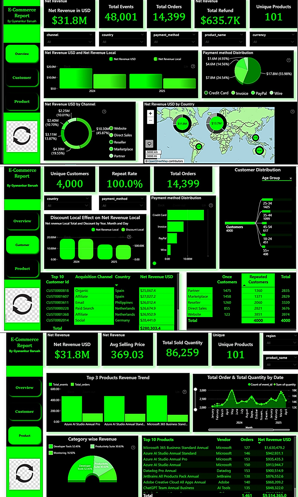
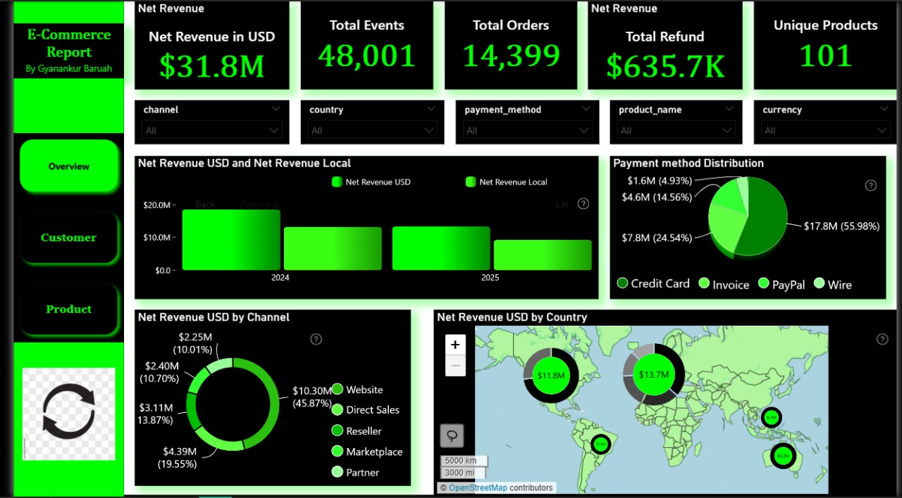
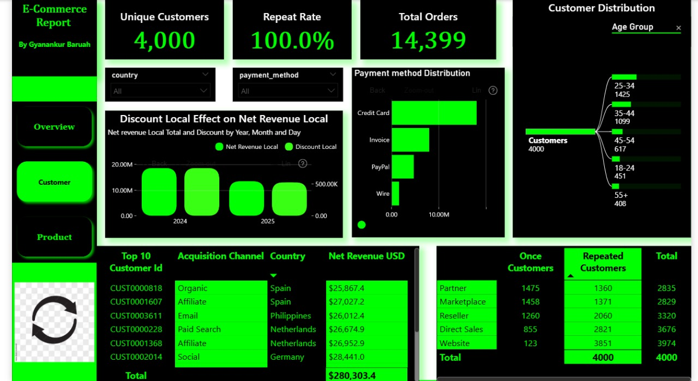
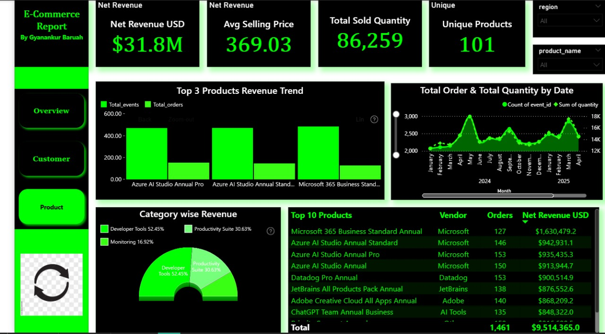

# E-commerce-Onyx-Data-Challenge-32-Report

##  Challenge Overview  
This repository contains my submission for the **November 2025 Onyx DataDNA Challenge**, focused on analyzing an E-Commerce dataset using Power BI. The goal was to uncover business insights across revenue, customer behavior, product performance, and payment trends.

### Combined View – Full Dashboard Snapshot  

---

## Dashboard Narrative  
The dashboard was designed to reflect how geography, product categories, and payment methods shape revenue outcomes. I layered filters, dynamic visuals, and storytelling logic to make the report intuitive and insight-rich.

### Key Insights:
- **Net Revenue:** $31.8M across all channels  
- **Top Regions:** Europe ($13.7M) and USA ($11.4M) led revenue  
- **Payment Methods:** Wire transfers dominated with 56% share  
- **Sales Channels:** Website and Direct Sales contributed over 65% of revenue  
- **Customer Retention:** 100% repeat rate — strong loyalty signal  
- **Top Products:** Microsoft 365, Azure AI Studio, Datadog Pro  
- **Category Leaders:** Developer Tools (36.45%) and Productivity Suites (30.63%)  
- **Customer Age Group:** 25–34 was the most active segment  
- **High-Value Customers:** Spain, Netherlands, and Germany emerged as top contributors

---

## 📷 Dashboard Visuals  

### Page 1 – Summary KPIs and Filters  

### Page 2 – Revenue by Channel, Country, and Payment Method  

### Page 3 – Product Performance & Customer Segments  

---

## 🔗 GitHub Repository  
This repository includes:
- All dashboard visuals  
- This README.md file

  
---

##  Acknowledgments  
Thanks to **Onyx Data**, **ZoomCharts**, **Smart Frames UI**, and **Data Career Jumpstart** for organizing this challenge and supporting the data community.

---

##  Author  
**Gyanankur Baruah**  
Connect with me on [LinkedIn](https://www.linkedin.com/in/gyanankurbaruah)
